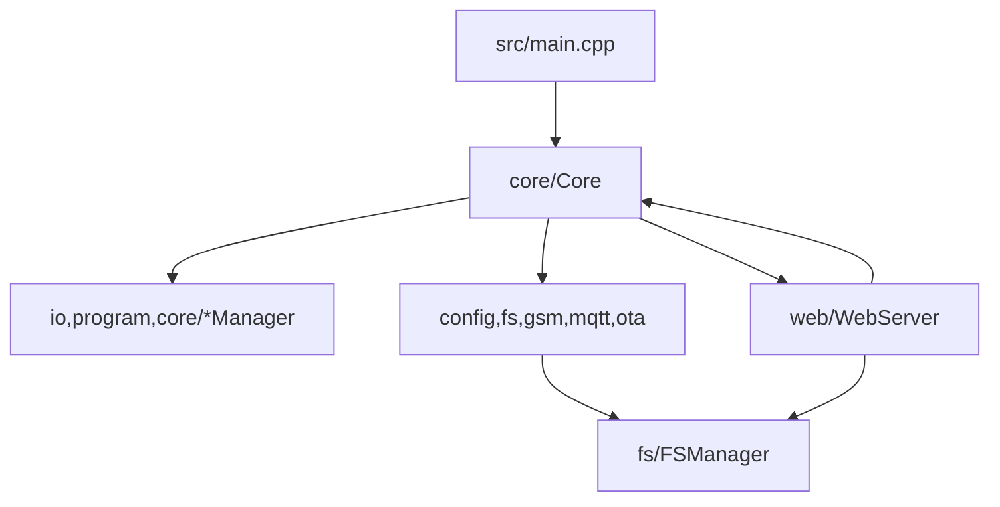

# Архитектура и правила модульности (ESP8266)

Этот документ фиксирует *контракты и ограничения* для кодовой базы. Он нужен, чтобы рефактор не превращался в набор
разрозненных правок и чтобы новые изменения не размывали границы модулей.

## 1) Слои и направление зависимостей

Цель — чтобы зависимости шли “сверху вниз”, а UI/transport не протекали в доменную логику.

Рекомендуемая схема:

Разрешённые направления (упрощённо):
- **`core` →** любые подсистемы (orchestration).
- **`core/*Manager`, `io`, `program` →** `config` (чтение настроек) и друг к другу по необходимости.
- **`config` →** `fs` (чтение/запись файлов), но не наоборот.
- **`web` →** `core`, `config`, `fs` (через узкие контракты); **запрещено** тянуть web в `io/program/core-managers`.

### “Точка правды” для цикла
Для устойчивости на ESP8266 важно, чтобы **весь** прогресс происходил в одном контролируемом месте:
- `setup()` вызывает `core.begin()`;
- `loop()` вызывает `core.update()` и больше ничего.

Так проще гарантировать:
- регулярное обслуживание watchdog;
- периодическое `yield()`/time slicing для WiFi/lwIP;
- отсутствие пересечения flash-операций с логикой выполнения программ.

## 2) Public vs internal (границы заголовков)

Правило: **публичная поверхность модуля — только `include/<domain>/*.h`.**

### Public headers (`include/**`)
Должны:
- описывать контракт модуля: что гарантирует, что требует, какие инварианты;
- по возможности избегать “тяжёлых” include’ов (forward declarations, перенос реализации в `.cpp`);
- не включать “внутренние” заголовки других подсистем.

### Internal headers (`src/<domain>/internal/**`)
- являются частью реализации;
- **не включаются вне `src/<domain>/**`**;
- могут включать тяжёлые зависимости и детали, необходимые только реализации.

Практический приём:
- public header даёт минимальный API;
- `.cpp` и `internal` хедеры включают всё остальное.

## 3) Политика работы с памятью (ESP8266)

### Heap churn / `String`
`String` допускается только там, где API Arduino/ESPAsyncWebServer принуждает к этому.

Запрещено:
- хранить `String` в полях “живущих долго” объектов (если это не строго обосновано);
- делать `String`-конкатенации в циклах и hot-path;
- превращать `String` в “универсальный буфер”.

Разрешено:
- краткоживущие `const String&` из параметров HTTP/FS Dir API с немедленным разбором в числовые/`char[]`.

### JSON
Для web/api/sse и MQTT:
- JSON эмитится в фиксированные/`char[]` буферы или потоково в Print (`sendJsonBuffered`, SAX parser);
- ёмкости/лимиты фиксируем в `include/common/Constants.h` (`JsonBytes::*`), не раздуваем без необходимости.

Дополнение (baseline RAM):
- Для рантайм-исполнения программ используем компактные шаги без строк (`CompiledStep`) вместо `Step`.
- Эндпоинт `/bootstrap` — один buffered JSON (inventory + `live`), без отдельного `/bootstrap/live`.
- MQTT использует **выделенные топики из конфигурации** (`BaseConfig.mqtt.cmd_topic/status_topic`) и по возможности
  публикует JSON **без промежуточных больших payload-буферов в `.bss`**, чтобы не раздувать baseline RAM.

## 3.0) MQTT contract (топики, сообщения, доставка)
MQTT — это часть рантайм-коммуникаций и чувствителен к стабильности цикла (ESP8266 + GSM).

Фиксируем контракт:
- **Идентификация устройства только по топику**: никаких `deviceId`/`unitId` в payload.
- **Топики берутся из конфигурации**: `BaseConfig.mqtt.cmd_topic` и `BaseConfig.mqtt.status_topic`.
  Эти топики должны быть **выделенными под устройство** (не общими для группы).
- **Delivery по умолчанию**:
  - LWT `"offline"` на `status_topic`: QoS1 + retained
  - `"online"` при connect на `status_topic`: retained
  - периодический JSON-статус: best-effort, not-retained, раз в `publish_interval_sec`
- **Anti-hang**: публикация JSON-статуса только по таймеру; чтение/запись в транспорт режутся лимитами `MqttFsmClient::Budgets`
  (`src/mqtt/MqttFsmClient.cpp`). Локальное время «измерить + застейджить» JSON ограничивают **логируемым** порогом
  (~10 мс в `MQTTClient::publishStatus`) и не приводят к принудительному `disconnect()` сами по себе.

### Долгие операции и watchdog/cooperate
Любые потенциально долгие операции (flash, большие сериализации, loop’ы по файлам):
- должны содержать “time slicing”: `Core::cooperate()` / `ESP.wdtFeed()` (в зависимости от контекста);
- не должны вызываться из enter/exit режимов без явного разбиения по времени.

## 3.3) Memory lifecycle contract по режимам

Чтобы уменьшить OOM в OTA/GSM сценариях, вводим явный контракт по памяти между `Core`, `WebServer`, `CellularCore` и `ModeManager`.

- `NORMAL` / `NORMAL_SILENT`:
  - GSM/MQTT обслуживаются штатно, SSE incremental работает в обычных порогах очереди.
  - В `NORMAL` при SoftAP up cellular **servится вместе с UI** (ESP32-C3). Suspend только
    когда SoftAP down или при OTA upload pressure.
- `pre-OTA` (окно `POST /upload` до фактического `switchMode(OTA_UPDATE)`):
  - активируется `otaUploadPressureActive`;
  - `CellularCore` временно приглушается (через `suspendCellularLink()` в handler NORMAL);
  - SSE/log канал работает в пониженных лимитах очереди (`WebSseLimits::OTA_PREP_*`), а вторичные лог-сообщения могут дропаться;
  - собираются heap-снимки (`free/maxBlk/frag`) в точках upload start/finish/fail.
- `OTA_UPDATE`:
  - `otaUploadPressureActive` выключается;
  - перед `Update.begin` закрывается SSE (`closeSseForOta()`), реле переводятся в safe state;
  - GSM/MQTT остаются suspend до выхода из OTA.

Ключевая идея: в пред-OTA и OTA фазах приоритет у непрерывного блока heap для `Update.begin` и у предсказуемого RAM-профиля, а не у полноты логов/SSE.

Операционный чеклист и пороги SLO для реального железа зафиксированы в [`docs/RAM_STABILIZATION_PLAYBOOK.md`](RAM_STABILIZATION_PLAYBOOK.md).

## 3.1) “Горячие” и “холодные” зоны

**Hot-path** — всё, что выполняется часто и влияет на стабильность:
- `Core::update()` и handlers режимов (`handleNormal`, `handleNormalSilent`, …)
- `io/*::update()` (входы/реле/сенсоры)
- `ProgramExecutor::update()`
- FSM GSM/MQTT service в NORMAL режимах
- web housekeeping (`WebServer::update()`) и периодическая отправка SSE статуса

Правило: в hot-path не добавляем новую динамику (`String`, большие временные JSON, malloc/free).

## 3.2) Cellular (SIM800): AT/transport/logging contracts

Поведение `begin()`/`INIT` (дефолтная скорость UART, условный поиск baud, `AT+IPR?` перед записью NV) описано в [`docs/modules/gsm_modem.md`](modules/gsm_modem.md) (раздел «UART: гипотеза скорости и поиск baud»); константы — только из `namespace GSM` в `Constants.h`.

### Единый AT pipeline
- **Все AT-команды должны идти через `AtSession` + `ModemUart`**, а не напрямую через `Serial.flush()`.
- Причина: единый контроль таймаутов/очередей + WDT-safety (yield/time slicing).

### SIM800 TCP transport (RX/TX)
- Connect/Close управляются URC (`CONNECT OK`, `CLOSED`, `SEND OK/FAIL`).
- RX стратегия по умолчанию: **push `+IPD`** (`AT+CIPRXGET=0`).
- Важно: payload `+IPD` — бинарный, line-framing должен быть отключён (`dataMode`) на время приёма payload.

### Recovery levels (предсказуемость)
При сбоях связь восстанавливаем по уровням (от дешёвого к дорогому):
- L1: TCP reconnect (повтор `CIPSTART`, backoff)
- L2: reset IP stack: `CIPSHUT`
- L3: bearer reset: `SAPBR=0,1` → `SAPBR=1,1`
- L4: modem reset: `CFUN=1,1`

### SSE logs: anti-WDT policy
- При активной UI-сессии возможен log-storm (GSM churn + transport polling).
- Политика: **лучше дропать логи, чем ловить WDT** (token bucket throttling в `Logger`).

## 3.4) Decision gate: замена сетевого стека

Полная замена `ESPAsyncWebServer`/`AsyncTCP` не делается “по умолчанию” при первом OOM.

Разрешение на миграцию даётся только если:
- OOM в `accept` повторяется после выполнения P0 мер и memory SLO из playbook;
- AP/SSE лимиты и low-heap guards не стабилизируют первый web-клиент;
- команда согласовала риск регрессий API/SSE и длительный цикл валидации.

## 4) Политика доступа к LittleFS

Правило: **вся работа с FS только через `FSManager` (`fileSystem`)**.

Исключение:
- если сторонняя библиотека требует `FS&`, разрешено передать `fileSystem.webFs()`,
  но *не* использовать этот объект для произвольных `open/remove/exists` и т.п.

Причина:
- централизованный учёт ошибок и атомарность;
- единая политика deferred операций (чтобы не пересекать flash с выполнением программы).

## 5) Комментарии (стиль “осмысленной документации”)

Комментарии должны отвечать на вопросы:
- **контракт**: что гарантирует функция/класс, что требует, что не делает;
- **инварианты**: что должно оставаться истинным всегда (особенно в FSM и deferred-очередях);
- **ограничения ESP8266**: почему выбран такой подход (heap, lwIP, WDT, LittleFS rename).

Удаляем:
- дублирование очевидного (“инициализируем переменную”, “вызываем update”);
- устаревшие/ложные утверждения (“описано в WebServer.cpp”, если файла уже нет).

## 6) Паттерн “узкий контракт” между модулями

Когда подсистеме A нужно знать что-то о подсистеме B:
- сначала пытаемся выразить это как **маленький контракт** (метод/тип/enum), а не как `#include` всего B в public header A;
- реализацию оставляем в `.cpp`, где можно подключить тяжёлые заголовки.

Цель:
- уменьшить compile fanout;
- сделать зависимости видимыми и устойчивыми (без “случайных” транзитивных include’ов).

