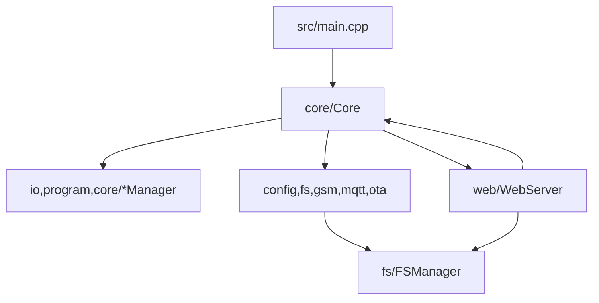

# Архитектура и правила модульности (ESP32-C3)

Этот документ фиксирует *контракты и ограничения* для кодовой базы. Он нужен, чтобы рефактор не превращался в набор
разрозненных правок и чтобы новые изменения не размывали границы модулей.

Target: PlatformIO env `esp32c3` (~170 KB free heap after boot). Исторические заметки по ESP8266 — в `docs/archive/`.

## 1) Слои и направление зависимостей

Цель — чтобы зависимости шли “сверху вниз”, а UI/transport не протекали в доменную логику.

Рекомендуемая схема:

Разрешённые направления (упрощённо):
- **`core` →** любые подсистемы (orchestration).
- **`core/*Manager`, `io`, `program` →** `config` (чтение настроек) и друг к другу по необходимости.
- **`config` →** `fs` (чтение/запись файлов), но не наоборот.
- **`web` →** `core`, `config`, `fs` (через узкие контракты); **запрещено** тянуть web в `io/program/core-managers`.

### “Точка правды” для цикла
Весь прогресс — в одном контролируемом месте:
- `setup()` вызывает `core.begin()`;
- `loop()` вызывает `core.update()` и больше ничего.

Так проще гарантировать:
- регулярное обслуживание watchdog / `Core::cooperate()`;
- fairness FreeRTOS + lwIP при длинных FS/OTA циклах;
- отсутствие пересечения flash-операций с логикой выполнения программ.

## 2) Public vs internal (границы заголовков)

Правило: **публичная поверхность модуля — только `include/<domain>/*.h`.**

### Public headers (`include/**`)
Должны:
- описывать контракт модуля: что гарантирует, что требует, какие инварианты;
- по возможности избегать “тяжёлых” include’ов (forward declarations, перенос реализации в `.cpp`);
- не включать “внутренние” заголовки других подсистем.

### Internal headers (`src/<domain>/internal/**`)
- являются частью реализации;
- **не включаются вне `src/<domain>/**`**;
- могут включать тяжёлые зависимости и детали, необходимые только реализации.

Практический приём:
- public header даёт минимальный API;
- `.cpp` и `internal` хедеры включают всё остальное.

## 3) Политика работы с памятью (ESP32-C3)

Heap headroom заметно выше, чем на ESP8266, но предсказуемый RAM-профиль всё ещё важен (OTA `Update.begin`, SoftAP+SSE+GSM).

### Heap churn / `String`
`String` допускается только там, где API Arduino/ESPAsyncWebServer принуждает к этому.

Запрещено:
- хранить `String` в полях “живущих долго” объектов (если это не строго обосновано);
- делать `String`-конкатенации в циклах и hot-path;
- превращать `String` в “универсальный буфер”.

Разрешено:
- краткоживущие `const String&` из параметров HTTP/FS Dir API с немедленным разбором в числовые/`char[]`.

### JSON
Для web/api/sse и MQTT:
- JSON эмитится в фиксированные/`char[]` буферы или потоково в Print (`sendJsonBuffered`, SAX parser);
- ёмкости/лимиты фиксируем в `include/common/Constants.h` (`JsonBytes::*`).

Дополнение:
- Для рантайм-исполнения программ — компактные шаги без строк (`CompiledStep`).
- Эндпоинт `/bootstrap` — один buffered JSON (inventory + `live`).
- MQTT: выделенные топики из конфигурации; payload caps (`STATUS_PAYLOAD_MAX_BYTES=900`) согласованы с `MqttFsmClient::TX_MAX=1024`. Нормативный JSON статуса — `docs/modules/mqtt.md` §3 (`engineRunning`, `inputsById` → `relaysById` → `tempSensorsById`).

## 3.0) MQTT contract (топики, сообщения, доставка)
MQTT чувствителен к стабильности цикла (SIM800 + SoftAP).

Фиксируем контракт:
- **Идентификация устройства только по топику**: никаких `deviceId`/`unitId` в payload.
- **Топики**: пользователь задаёт только `BaseConfig.mqtt.topic_prefix`; суффиксы фиксированы:
  `/avail` (presence), `/status` (JSON), `/cmd` (команды), `/reply` (ответы).
- **Delivery по умолчанию**:
  - LWT `"offline"` на `{prefix}/avail`: QoS1 + retained
  - `"online"` при connect на `{prefix}/avail`: retained (независимо от JSON)
  - периодический JSON на `{prefix}/status`: best-effort, not-retained, раз в `publish_interval_sec`
    (контракт полей: `docs/modules/mqtt.md` §3; без усечения полей)
- **Anti-hang**: публикация JSON-статуса только по таймеру; чтение/запись в транспорт режутся лимитами `MqttFsmClient::Budgets`.
  Локальное время «измерить + застейджить» JSON ограничивают **логируемым** порогом
  (~10 мс в `MQTTClient::publishStatus`) и не приводят к принудительному `disconnect()` сами по себе.
  SIM800: send-epoch до `SEND OK`, `POST_BOOT_SETTLE_MS` до `gsm.begin()`, `mqtt.loop` только когда `!tcpBusBusy()` (см. `docs/modules/gsm_modem.md`).

### Долгие операции и watchdog/cooperate
Любые потенциально долгие операции (flash, большие сериализации, loop’ы по файлам):
- должны содержать “time slicing”: `Core::cooperate()` / `espHalFeedWdt()` (= `yield()`);
- не должны вызываться из enter/exit режимов без явного разбиения по времени.

## 3.3) Memory lifecycle contract по режимам

Контракт по памяти между `Core`, `WebServer`, `CellularCore` и `ModeManager`:

- `NORMAL` / `NORMAL_SILENT`:
  - GSM/MQTT обслуживаются штатно (в NORMAL — при SoftAP up), SSE incremental в обычных soft queue.
- `OTA_UPDATE` (в т.ч. во время stream-upload):
  - программы stop, реле safe, cellular suspend;
  - **SSE остаётся** (логи/статус под обычными soft gates);
  - пакет льётся стримом в `Update` + FS tail, без полного `/update.bin` на LittleFS;
  - после успешного `streamFinish` — reboot.

Pre-OTA `otaUploadPressureActive` / `OTA_PREP_*` / `closeSseForOta` **удалены** (ESP32-C3).

Полевой baseline: [`docs/ESP32C3.md`](ESP32C3.md). Детали stream OTA: [`docs/modules/ota.md`](modules/ota.md).

## 3.1) “Горячие” и “холодные” зоны

**Hot-path** — всё, что выполняется часто и влияет на стабильность:
- `Core::update()` и handlers режимов
- `io/*::update()`
- `ProgramExecutor::update()`
- FSM GSM/MQTT service в NORMAL режимах
- web housekeeping (`WebServer::update()`) и периодическая отправка SSE статуса

Правило: в hot-path не добавляем новую динамику (`String`, большие временные JSON, malloc/free).

## 3.2) Cellular (SIM800): AT/transport/logging contracts

Поведение `begin()`/`INIT` описано в [`docs/modules/gsm_modem.md`](modules/gsm_modem.md); константы — только из `namespace GSM` в `Constants.h`.

### Единый AT pipeline
- **Все AT-команды должны идти через `AtSession` + `ModemUart`**.
- Причина: единый контроль таймаутов/очередей + WDT-safety (yield/time slicing).

### SIM800 TCP transport (RX/TX)
- Connect/Close управляются URC (`CONNECT OK`, `CLOSED`, `SEND OK/FAIL`).
- RX стратегия по умолчанию: **push `+IPD`** (`AT+CIPRXGET=0`).
- Важно: payload `+IPD` — бинарный, line-framing должен быть отключён (`dataMode`) на время приёма payload.

### Recovery levels (предсказуемость)
При сбоях связь восстанавливаем по уровням (от дешёвого к дорогому):
- L1: restart GSM FSM (`begin` после cooldown)
- L2: reset IP stack: `CIPSHUT`
- L3: bearer reset: `SAPBR=0,1`
- L4: modem reset: `CFUN=1,1` (+ сброс sticky UART verify)
- На READY отдельно: TCP reconnect / reattach с backoff (MQTT + `handleReady`)

### SSE logs: backpressure policy
- При активной UI-сессии возможен log-storm (GSM churn + transport polling).
- Политика: **лучше дропать логи через soft/OTA SSE queue gates**, чем блокировать loop.
  Встроенного token-bucket throttle в `Logger` больше нет — gate на стороне `WebServer`.

## 3.4) Decision gate: замена сетевого стека

Полная замена `ESPAsyncWebServer` не делается “по умолчанию” при первом OOM.

Разрешение на миграцию даётся только если:
- OOM в `accept` повторяется после OTA pressure / SSE queue limits;
- команда согласовала риск регрессий API/SSE и длительный цикл валидации.

## 4) Политика доступа к LittleFS

Правило: **вся работа с FS только через `FSManager` (`fileSystem`)**.

Исключение:
- если сторонняя библиотека требует `FS&`, разрешено передать `fileSystem.webFs()`,
  но *не* использовать этот объект для произвольных `open/remove/exists` и т.п.

Причина:
- централизованный учёт ошибок и атомарность;
- единая политика deferred операций (чтобы не пересекать flash с выполнением программы).

`FSManager::gc()` на ESP32 Arduino **не компактирует** том: reclaim известных orphan temp + refresh free-space. После вызова всегда проверяйте `getFreeSpace()`.

## 5) Комментарии (стиль “осмысленной документации”)

Комментарии должны отвечать на вопросы:
- **контракт**: что гарантирует функция/класс, что требует, что не делает;
- **инварианты**: что должно оставаться истинным всегда (особенно в FSM и deferred-очередях);
- **ограничения платформы**: почему выбран такой подход (heap, SoftAP+GSM, LittleFS rename, SIM800).

Удаляем:
- дублирование очевидного;
- устаревшие/ложные утверждения про ESP8266 soft WDT / `LittleFS.gc()` / Logger throttle, если поведения уже нет.

## 6) Паттерн “узкий контракт” между модулями

Когда подсистеме A нужно знать что-то о подсистеме B:
- сначала пытаемся выразить это как **маленький контракт** (метод/тип/enum), а не как `#include` всего B в public header A;
- реализацию оставляем в `.cpp`, где можно подключить тяжёлые заголовки.

Цель:
- уменьшить compile fanout;
- сделать зависимости видимыми и устойчивыми (без “случайных” транзитивных include’ов).
